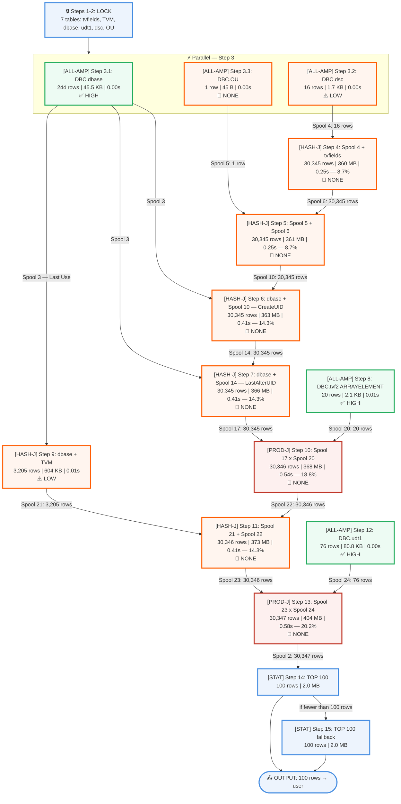

## EXPLAIN Analysis: `sel top 100 * from dbc.columnsV`

### Summary

| Metric | Value |
|--------|-------|
| Total Est. Time | 2.87s |
| Steps | 16 (6 retrieves, 7 joins, 2 stat functions, 1 end) |
| Product Joins | 2 (Steps 10, 13 — bounded by small tables) |
| No Confidence Steps | 10 |
| Low Confidence Steps | 2 (Steps 3.2, 9) |
| High Confidence Steps | 3 (Steps 3.1, 8, 12) |
| Result Rows | 100 (TOP 100) |

### Query Plan

### Step Details

| Step | Operation | Table/Spool | Rows | Size | Time (%) | Confidence | Severity |
|------|-----------|-------------|------|------|----------|------------|----------|
| 1-2 | LOCK | tvfields, TVM, dbase, udt1, dsc, OU | — | — | — | — | info |
| 3.1 | ALL-AMP RETRIEVE | DBC.dbase → Spool 3 (DUP-ALL) | 244 | 45.5 KB | 0.00s | high | good |
| 3.2 | ALL-AMP RETRIEVE | DBC.dsc → Spool 4 (DUP-ALL) | 16 | 1.7 KB | 0.00s | low | warning |
| 3.3 | ALL-AMP RETRIEVE | DBC.OU → Spool 5 (REDIST) | 1 | 45 B | 0.00s | none | warning |
| 4 | HASH-J (dynamic) | Spool 4 + tvfields → Spool 6 | 30,345 | 360 MB | 0.25s (8.7%) | none | warning |
| 5 | HASH-J (50 part.) | Spool 5 + Spool 6 → Spool 10 | 30,345 | 361 MB | 0.25s (8.7%) | none | warning |
| 6 | HASH-J (single part.) | Spool 3 + Spool 10 → Spool 14 | 30,345 | 363 MB | 0.41s (14.3%) | none | warning |
| 7 | HASH-J (single part.) | Spool 3 + Spool 14 → Spool 17 | 30,345 | 366 MB | 0.41s (14.3%) | none | warning |
| 8 | ALL-AMP RETRIEVE | DBC.tvf2 → Spool 20 (DUP-ALL) | 20 | 2.1 KB | 0.01s (0.3%) | high | good |
| 9 | HASH-J (dynamic) | Spool 3 + TVM → Spool 21 (REDIST) | 3,205 | 604 KB | 0.01s (0.3%) | low | warning |
| 10 | **PROD-J** | Spool 17 + Spool 20 → Spool 22 | 30,346 | 368 MB | **0.54s (18.8%)** | none | **critical** |
| 11 | HASH-J (single part.) | Spool 21 + Spool 22 → Spool 23 | 30,346 | 373 MB | 0.41s (14.3%) | none | warning |
| 12 | ALL-AMP RETRIEVE | DBC.udt1 → Spool 24 (DUP-ALL) | 76 | 80.8 KB | 0.00s | high | good |
| 13 | **PROD-J** | Spool 23 + Spool 24 → Spool 2 | 30,347 | 404 MB | **0.58s (20.2%)** | none | **critical** |
| 14 | STAT FUNCTION | Spool 2 → Spool 1 (TOP 100) | 100 | 2.0 MB | — | none | info |
| 15 | STAT FUNCTION | Spool 2 → Spool 1 (fallback) | 100 | 2.0 MB | — | none | info |
| 16 | END TRANSACTION | Spool 1 → user | 100 | — | — | — | info |

### Top Bottlenecks

1. **Step 13** — Product join (Spool 23 x udt1) — 0.58s (20.2%)
2. **Step 10** — Product join (Spool 17 x tvf2) — 0.54s (18.8%)
3. **Step 6** — Hash join (dbase CreateUID resolution) — 0.41s (14.3%)
4. **Step 7** — Hash join (dbase LastAlterUID resolution) — 0.41s (14.3%)
5. **Step 11** — Hash join (TVM + tvf2 result) — 0.41s (14.3%)

### Optimization Playbook

#### 🟡 Informational — No Action Required

- **Product joins (Steps 10, 13):** These are the costliest steps at 18.8% and 20.2% of total time. However, both join a large spool against a tiny duplicated table: Spool 20 has 20 rows (tvf2 array element lookup) and Spool 24 has 76 rows (udt1 type metadata). Worst-case comparisons: 30,346 x 20 = 607K and 30,346 x 76 = 2.3M per AMP — bounded and acceptable. **This is inherent to the columnsV view definition.**

- **No confidence estimates (10 of 16 steps):** Expected for DBC dictionary views. The optimizer does not maintain statistics on internal system tables in the traditional way. You cannot `COLLECT STATISTICS` on DBC tables. The row estimates (~30,345) are reasonable placeholders.

- **Low confidence (Steps 3.2, 9):** DBC.dsc (16 rows) and the dbase+TVM join (3,205 rows) have partial statistics. Acceptable for small result sets.

#### 🟢 Good Practices Confirmed

- **Efficient spool management:** Spool 3 (dbase, 244 rows) is duplicated once and reused across Steps 6, 7, and 9 before being freed at Last Use — avoiding repeated scans.
- **Parallel execution:** Steps 3.1, 3.2, 3.3 run in parallel to minimize wall-clock time for the initial retrieves.
- **Local builds:** All intermediate join spools are built locally on the AMPs — no unnecessary redistribution until Step 9 (which redistributes the small TVM join result by TVMId).
- **Hash join partitioning:** Steps 4-5 use 50-partition hash joins for efficient processing of the tvfields+OU join.

### Key Insights

- **Data flow:** 7 internal DBC tables (tvfields, TVM, dbase, udt1, dsc, OU, tvf2) are joined to build the columnsV view. Row count stays stable at ~30,345 through the join chain, growing only in row width (360 MB → 404 MB) as columns are added.
- **Critical path:** Steps 4 → 5 → 6 → 7 → 10 → 11 → 13 form the sequential critical path at 2.85s of the 2.87s total. Steps 8, 9, and 12 are cheap side retrieves (0.01s each) that feed into the main chain.
- **No user action needed:** This is a system dictionary view. All product joins, no-confidence estimates, and full-table scans are inherent to how Teradata materializes `dbc.columnsV` and cannot be tuned by users.
